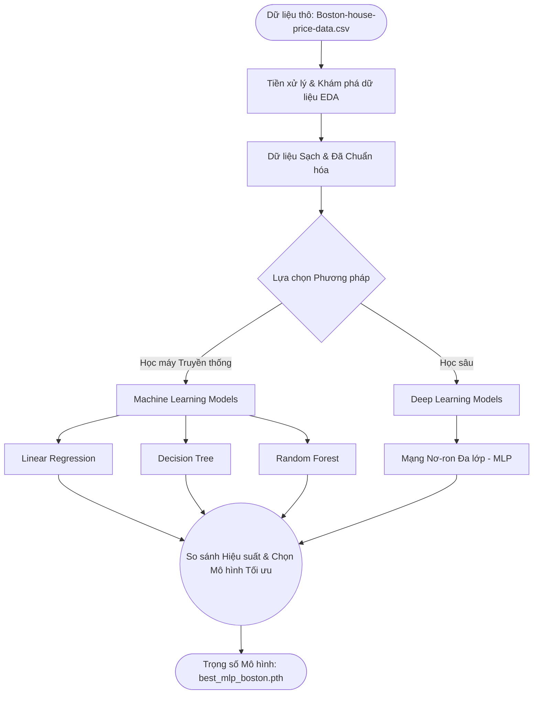

# Cấu trúc Tổng thể Dự án (Overall Pipeline)

Sơ đồ dưới đây minh họa góc nhìn chim bay (bird's-eye view) từ lúc nhận dữ liệu thô cho tới lúc ra quyết định chọn mô hình tốt nhất.

```mermaid
graph TD
    A([Dữ liệu thô: Boston-house-price-data.csv]) --> B[Tiền xử lý & Khám phá dữ liệu EDA]
    B --> C[Dữ liệu Sạch & Đã Chuẩn hóa]
    
    C --> D{Lựa chọn Phương pháp}
    
    D -->|Học máy Truyền thống| E[Machine Learning Models]
    E --> E1[Linear Regression]
    E --> E2[Decision Tree]
    E --> E3[Random Forest]
    
    D -->|Học sâu| F[Deep Learning Models]
    F --> F1[Mạng Nơ-ron Đa lớp - MLP]
    
    E1 --> G((So sánh Hiệu suất & Chọn Mô hình Tối ưu))
    E2 --> G
    E3 --> G
    F1 --> G
    
    G --> H([Trọng số Mô hình: best_mlp_boston.pth])
```
