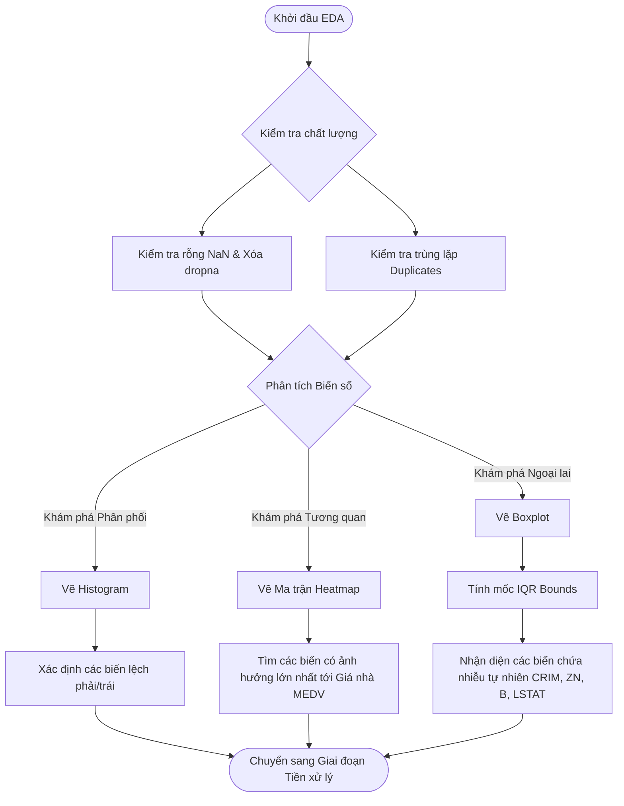

# Quy trình Phân tích Khám phá Dữ liệu (EDA Workflow)

Sơ đồ chi tiết giải thích các bước trực quan hóa và kiểm tra chất lượng dữ liệu để hiểu rõ nghiệp vụ của thị trường bất động sản.

```mermaid
graph TD
    A([Khởi đầu EDA]) --> B{Kiểm tra chất lượng}
    B --> C[Kiểm tra rỗng NaN & Xóa dropna]
    B --> D[Kiểm tra trùng lặp Duplicates]
    
    C --> E{Phân tích Biến số}
    D --> E
    
    E -->|Khám phá Phân phối| F[Vẽ Histogram]
    F --> F1[Xác định các biến lệch phải/trái]
    
    E -->|Khám phá Tương quan| G[Vẽ Ma trận Heatmap]
    G --> G1[Tìm các biến có ảnh hưởng lớn nhất tới Giá nhà MEDV]
    
    E -->|Khám phá Ngoại lai| H[Vẽ Boxplot]
    H --> H1[Tính mốc IQR Bounds]
    H1 --> H2[Nhận diện các biến chứa nhiễu tự nhiên CRIM, ZN, B, LSTAT]
    
    F1 --> I([Chuyển sang Giai đoạn Tiền xử lý])
    G1 --> I
    H2 --> I
```
