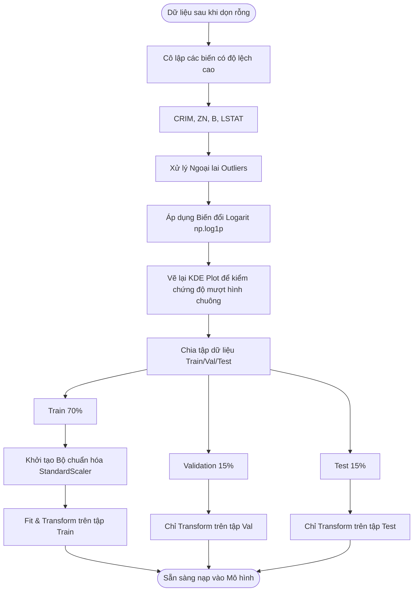

# Quy trình Tiền xử lý Dữ liệu (Preprocessing Pipeline)

Đây là bước can thiệp biến đổi dữ liệu (Feature Engineering) để AI có thể học được dễ dàng nhất.

```mermaid
graph TD
    A([Dữ liệu sau khi dọn rỗng]) --> B[Cô lập các biến có độ lệch cao]
    B --> C[CRIM, ZN, B, LSTAT]
    
    C --> D[Xử lý Ngoại lai Outliers]
    D --> E[Áp dụng Biến đổi Logarit np.log1p]
    E --> F[Vẽ lại KDE Plot để kiểm chứng độ mượt hình chuông]
    
    F --> G[Chia tập dữ liệu Train/Val/Test]
    G --> H[Train 70%]
    G --> I[Validation 15%]
    G --> J[Test 15%]
    
    H --> K[Khởi tạo Bộ chuẩn hóa StandardScaler]
    K --> L[Fit & Transform trên tập Train]
    
    I --> M[Chỉ Transform trên tập Val]
    J --> N[Chỉ Transform trên tập Test]
    
    L --> O([Sẵn sàng nạp vào Mô hình])
    M --> O
    N --> O
```
