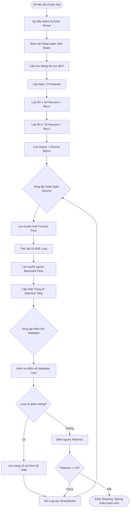

# Quy trình Xây dựng và Huấn luyện Mô hình Deep Learning

Sơ đồ diễn giải cơ chế vận hành của mạng Nơ-ron Đa lớp (MLP), từ việc chuyển đổi dữ liệu thành Tensor cho đến việc cập nhật trọng số.

```mermaid
graph TD
    A([Dữ liệu đã Chuẩn hóa]) --> B[Ép kiểu thành PyTorch Tensor]
    B --> C[Đưa vào DataLoader chia Batch]
    
    C --> D[Cấu trúc Mạng Nơ-ron MLP]
    D --> D1[Lớp Input: 13 Features]
    D1 --> D2[Lớp Ẩn 1: 64 Neurons + ReLU]
    D2 --> D3[Lớp Ẩn 2: 32 Neurons + ReLU]
    D3 --> D4[Lớp Output: 1 Neuron MEDV]
    
    D4 --> E{Vòng lặp Huấn luyện Epochs}
    E --> F[Lan truyền xuôi Forward Pass]
    F --> G[Tính Sai số MSE Loss]
    G --> H[Lan truyền ngược Backward Pass]
    H --> I[Cập nhật Trọng số Optimizer Step]
    
    I --> J{Vòng lặp Kiểm thử Validation}
    J --> K[Kiểm tra điểm số Validation Loss]
    
    K --> L{Loss có giảm không?}
    L -->|Có| M[Lưu trọng số mô hình tốt nhất]
    L -->|Không| N[Đếm ngược Patience]
    
    M --> O[Ghi Log vào TensorBoard]
    N --> P{Patience >= 20?}
    
    P -->|Chưa| O
    P -->|Rồi| Q([Early Stopping: Ngừng huấn luyện sớm])
    
    O --> E
```
