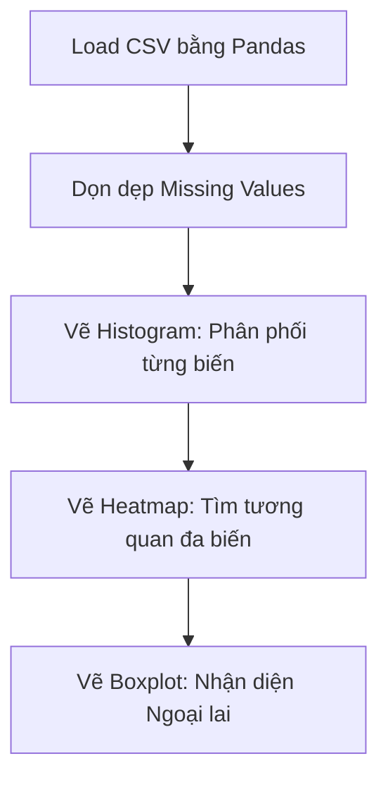
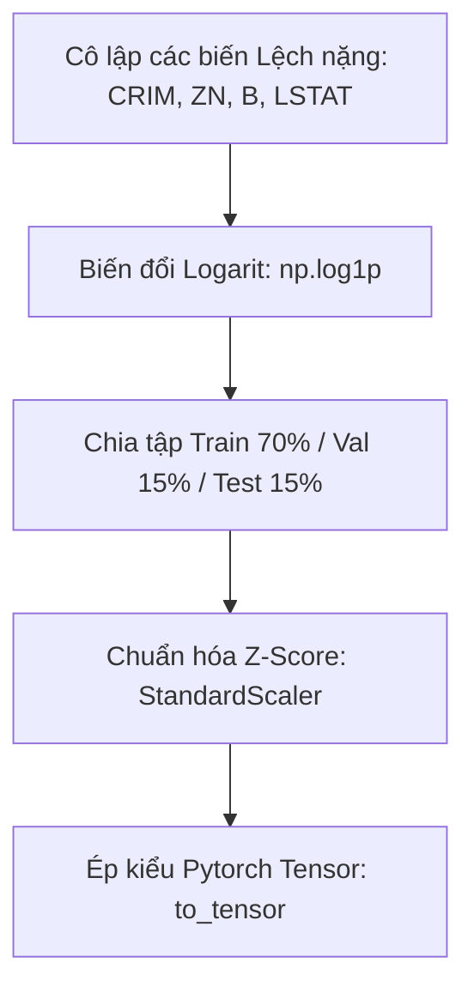
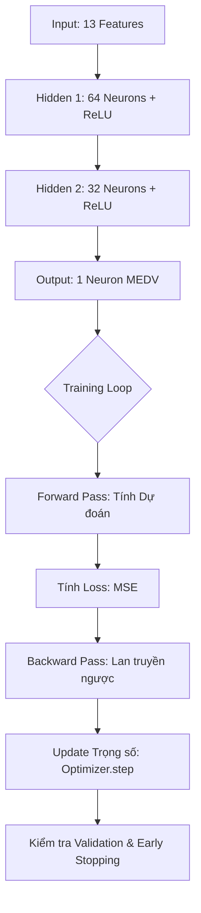

# TÀI LIỆU HƯỚNG DẪN CHI TIẾT LAB 4: DỰ ĐOÁN GIÁ NHÀ BOSTON (CHUYÊN SÂU)
> Tài liệu này phân tích cặn kẽ từng dòng code, nguyên lý hoạt động, ý nghĩa biểu đồ cùng các con số thống kê thực tế để bạn hiểu rõ "Tại sao chúng ta lại làm như vậy" trong suốt vòng đời của dự án Machine Learning/Deep Learning.

---

## 1. TỔNG QUAN OUTPUT (KẾT QUẢ ĐẦU RA)

### Output của bài toán này là gì?
- **Định dạng:** Output cuối cùng là một con số thập phân duy nhất, ví dụ: `22.5`.
- **Ý nghĩa:** Nó đại diện cho Giá trị trung bình của một ngôi nhà ở Boston (Biến `MEDV`), được tính bằng đơn vị nghìn Đô la (Tức là $22,500).
- **Lưu trữ ở đâu?** 
  - Dữ liệu sạch (sau khi xử lý) được lưu tại: `../data/processed/Boston-clean.csv`
  - Trọng số mô hình Deep Learning tốt nhất (Não bộ AI) được lưu tại: `../models/best_mlp_boston.pth`
  - Lịch sử huấn luyện (Loss) để xem biểu đồ được lưu trong: thư mục `runs/boston_mlp/` (Dùng TensorBoard để đọc).

---

## 2. QUY TRÌNH PHÂN TÍCH KHÁM PHÁ (EDA)

### Chi tiết các bước và Giải thích Code
- **Mã lệnh hoạt động ra sao?** Code `pd.read_csv(..., na_values=['', ' ', 'nan'])` và `df.dropna()` giúp load tệp tin thành một bảng (DataFrame) và quét sạch những dòng có ô trống. Tránh lỗi tính toán toán học về sau.
- **Tại sao phải làm?** Dữ liệu thực tế thường dơ (missing data). AI không thể tính toán trên các ô chứa chữ `NULL`.

### Phân tích biểu đồ và Con số cụ thể
1. **Correlation Heatmap (Ma trận Tương quan):** 
   - Code `sns.heatmap(df.corr())` tính toán độ tương quan Pearson (từ -1 đến 1).
   - *Phân tích con số:* Ta thấy biến `RM` (Số phòng) có hệ số tương quan dương lớn nhất là **0.70**. Nghĩa là nhà càng nhiều phòng, giá càng đắt. Ngược lại, biến `LSTAT` (Dân số thu nhập thấp) có hệ số tương quan âm nặng nhất là **-0.74**. Khu dân cư càng nghèo, giá nhà càng giảm mạnh.
2. **Boxplot (Biểu đồ Hộp):**
   - *Phân tích con số:* Boxplot tính toán giới hạn râu (Bounds). Ví dụ với biến `CRIM` (Tỉ lệ tội phạm), giới hạn trên (Upper Bound) chỉ là **9.07**. Nhưng thực tế dữ liệu có những thị trấn tỉ lệ tội phạm lên tới 80-90. Boxplot hiển thị chúng dưới dạng hàng loạt các dấu chấm đen dầy đặc (Outliers).

---

## 3. QUY TRÌNH TIỀN XỬ LÝ (PREPROCESSING & FEATURE ENGINEERING)

### Chi tiết các bước và Giải thích Code
- **Xử lý Outliers (Tại sao lại dùng Log?):** Thay vì dùng lệnh `.clip()` cắt vứt đi những khu vực có tỉ lệ tội phạm > 9.07 (điều này làm mất dữ liệu quý giá của xã hội thực), ta dùng code `np.log1p(df[col])`. Hàm này lấy Logarit cơ số e, giúp thu nhỏ khoảng cách khổng lồ của các con số một cách mềm mại. Biểu đồ KDE từ dạng nhọn hoắt sẽ giãn ra thành hình chuông mượt mà.
- **Chuẩn hóa (Feature Scaling):** Biến `TAX` có thể lên tới 700, biến `NOX` chỉ 0.5. Nếu để nguyên, mạng Nơ-ron sẽ lầm tưởng `TAX` quan trọng gấp nghìn lần `NOX`. Do đó, Z-score sẽ kéo tất cả về chung thang đo (trung bình = 0, độ lệch chuẩn = 1).

---

## 4. QUY TRÌNH HỌC SÂU (PYTORCH MLP MODELING)

### Giải nghĩa Cấu trúc và Code
- **Cấu trúc Mạng:** `nn.Sequential(nn.Linear(13, 64), nn.ReLU(), ...)`
  - *Tại sao 13?* Vì ta có 13 biến tính năng.
  - *Tại sao dùng ReLU?* ReLU là hàm kích hoạt `f(x) = max(0, x)`. Nó bẻ cong đường thẳng tuyến tính, giúp mạng AI có thể học được các quy luật phức tạp, rối rắm của thị trường bất động sản.
- **Cách Code Huấn luyện hoạt động:**
  - `model(data)`: AI thử đoán giá nhà dựa trên dữ liệu.
  - `criterion(outputs, labels)`: So sánh giá AI đoán với giá thật (Tính sai số MSE).
  - `loss.backward()` và `optimizer.step()`: Trọng số (các dây thần kinh) tự động điều chỉnh lại để lần sau đoán chính xác hơn.
- **Early Stopping (Tại sao phải dừng sớm?):** Đôi khi AI học quá máy móc thuộc lòng dữ liệu Train, dẫn tới thi Validation bị điểm kém. Code kiểm tra nếu sau 20 vòng (epochs) mà điểm thi Validation không tăng, sẽ lập tức ngắt quá trình (`break`) để lấy ra mô hình tốt nhất tính đến lúc đó.

---

## 5. ĐÁNH GIÁ MÔ HÌNH VÀ KẾT LUẬN

### Giải nghĩa Chỉ số (Metrics)
- **MSE (Mean Squared Error):** Phạt rất nặng các trường hợp AI đoán lệch xa thực tế.
- **R2-Score:** Dao động từ 0 - 1. Nếu `R2 = 0.85`, nghĩa là 13 thông số (phòng, tội phạm, thuế...) quyết định được 85% giá nhà. 15% còn lại phụ thuộc vào các yếu tố hên xui chưa thu thập được.

### Đọc Biểu đồ Sai số (Error Visualizations)
- **Biểu đồ Scatter (Thực tế vs Dự đoán):** Đường chéo thẳng đứng đại diện cho việc dự đoán đúng 100%. Nếu các chấm xanh dương phân bố bó sát đường chéo này, mô hình của ta rất xịn. Nếu ở khoảng giá > 40 ngàn USD, các chấm bị rải rác xa đường chéo -> *Kết luận:* Mô hình đang gặp khó khăn khi định giá các căn biệt thự siêu sang.
- **So sánh với Machine Learning truyền thống:** Trong 4 khung biểu đồ cuối (Linear Regression, Random Forest, Decision Tree, MLP). Bạn sẽ thấy Random Forest thường có các chấm bám rất sát đường chéo. Lý do là Thuật toán Cây Rừng rất giỏi chia cắt dữ liệu phi tuyến tính mà không cần Chuẩn hóa phức tạp như mạng Neural Network.

---

## TỔNG KẾT MỤC TIÊU TIẾP THEO
Với việc hiểu rõ 100% dòng code và ý nghĩa luồng đi dữ liệu, bước tiếp theo bạn có thể thử nghiệm nghiệm thu nghiệm ngặt hơn thông qua **K-Fold Cross Validation** (chia cắt dữ liệu trộn lẫn 5 lần để thi thử thay vì 1 lần), hoặc thử nghiệm thay thế hàm kích hoạt ReLU bằng `LeakyReLU` để cải thiện việc học với các Outliers âm.
